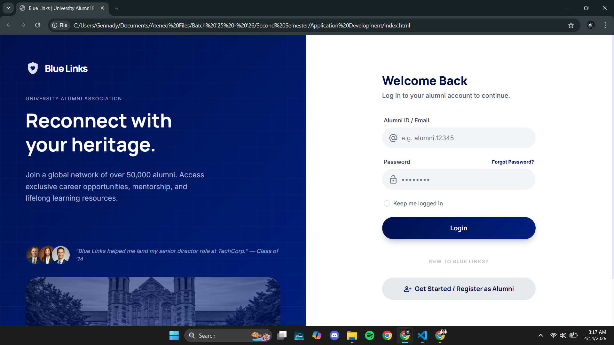
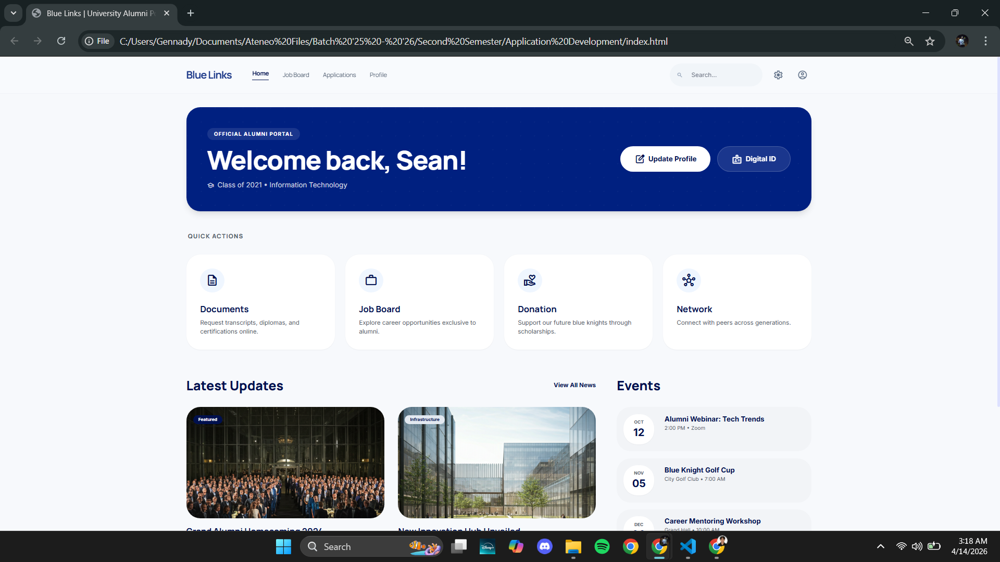
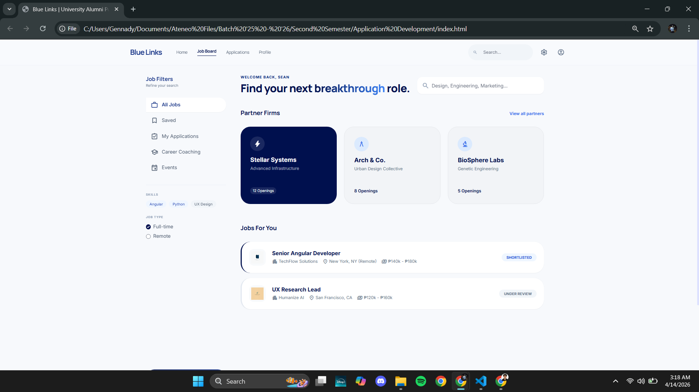
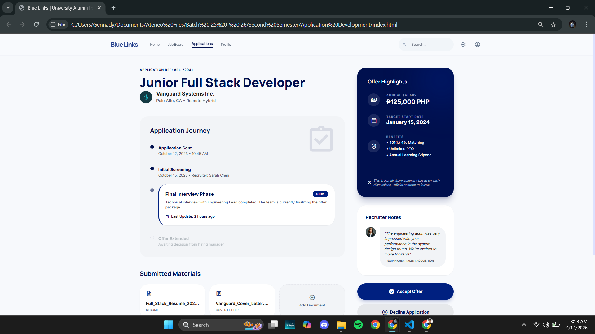
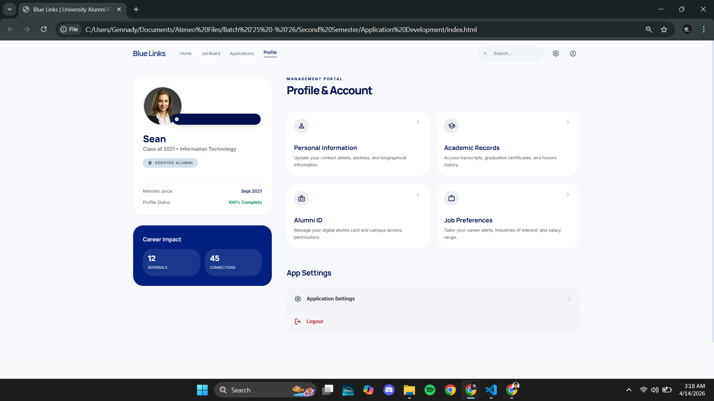
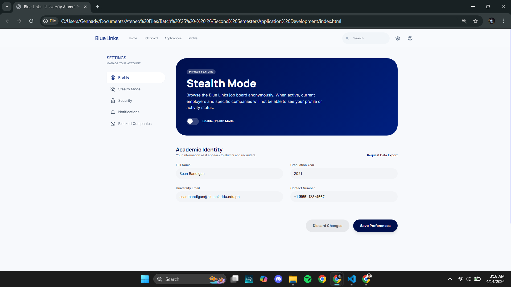

## Bandigan

Turning the mobile phone design prototype of the job application/posting into a website using the angular javascript framework. 

### Framework: Angular JS

### Module: Job Posting

### Installation

To replicate and run this project on a different computer. Follow the following steps.
## Setup & Run the Project (AngularJS)

### 1. Install Prerequisites

* Install Node.js (LTS version)
* npm comes with Node.js

```bash
node -v
npm -v
```

---

### 2. Clone the Repository

```bash
git clone <your-repo-url>
cd <your-project-folder>
```

---

### 3. Install Dependencies

```bash
npm install
```

---

### 4. Install Global Tools (if required)

```bash
npm install -g bower
npm install -g gulp-cli
npm install -g grunt-cli
```

If using Bower:

```bash
bower install
```

---

### 5. Setup Environment Variables (if needed)

```bash
cp .env.example .env
```

---

### 6. Run the Project

```bash
npm start
```

OR

```bash
gulp
```

OR

```bash
grunt
```

OR

```bash
npx http-server
```

---

### 7. Open in Browser

http://localhost:3000

---

### 8. Build for Production (if applicable)

```bash
npm run build
```

---

### 9. Common Fixes

```bash
rm -rf node_modules
npm install
```

```bash
npx kill-port 3000
```

```bash
nvm install <version>
nvm use <version>
```

### AI Tools:

1. Google Stitch
2. Claude
3. Deepseek

### Activity 14 Prompt
Act as a senior developer and convert this phone application design into a website. Stricly follow the color palette. Do not leave unnecessary details from the login page, to dashboard, to jobs section, to settings, to profile. Follow the fonts and color used, and everything shown from the images. Do not use emoji as icons, only icons same in the images. Make the website static only. While converting this design into a website, use the angular javascript framework. The website should be easy to use but follow a clean look layout of the website.

### Activity 15 Master Prompt
Instructions: 

1. The Git Workflow Repository: Continue using your public GitHub repository from Activity #14. Branching: Create a new branch specifically for this transformation: git checkout -b feature/pwa-ready. Why? In a professional environment, major architectural shifts like PWA conversion are always handled in a feature branch to preserve the stability of the "Main" codebase. 

2. The "Vibe Coding" Process: "Vibe Coding" isn't just copy-pasting; it’s a conversational flow with your AI (Cursor, ChatGPT, Claude, etc.). The Goal: Use AI to guide you through the PWA Requirements Checklist: (1) Generating a valid manifest.json (with University Branding). (2) Registering a Service Worker. (3) Implementing Caching Strategies so the app loads instantly and works offline. (4) Managing the App Icons (using the assets provided in the Branding Kit). 

3. Documentation (The AI Log) ReadMe Update: In your feature/pwa-ready branch, update your README.md. Include: The "Master Prompt" that successfully initiated your PWA conversion and a list of any "hallucinations" or errors you had to fix manually. 

4. The Deliverable: The "Architecture Deep-Dive" Video Upload an unlisted video (YouTube/Google Drive) showcasing your process. Your video must follow this specific sequence: 
(1) The Prompt: Show the initial prompt you used to tell the AI about your specific JS framework (e.g., "I am using SolidJS, help me make it a PWA"). 
(2) The Reasoning: Briefly explain why the AI suggested certain files (e.g., Why do we need the Service Worker?). 
(3) IDE Walkthrough: Show the code changes. Highlight the manifest.json, the Service Worker registration, and where the offline assets are cached. 
(4) The "Install" Demo: Run your project and show the "Install App" icon appearing in the browser address bar. 
(5) The "Offline" Stress Test: * Open Browser's DevTools → Application Tab → Service Workers.
 --- Check the "Offline" checkbox.
 --- Refresh the page. Everything—including images—must still load perfectly.

* I am tasked to create a project where I must convert my previous project into a Progressive Web App (PWA). By following the instruction above, guide me through the entire process. I also have given you the code to my previous project for your reference. 
* Take note of the following:
   * I am using Angular Javascript framework
   * Include manifest.json
   * Service Worker
   * Caching strategy for offline use
   * App icons setup
* Aside from just following the instruction. I would appreciate if you provide short explanations every step so that I can I understand what we are implementing to my project and the whole process of it.

### Screenshots

#### Login Page


#### Home Page


#### Job Board Page


#### Application Page


#### Profile Page


### Settings Page



